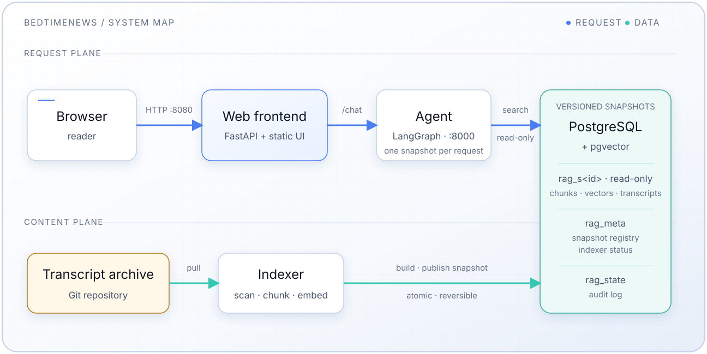

<h1 align="center">BedtimeNews Knowledge Base</h1>

<p align="center">
  <a href="https://github.com/BedtimeNewsStudio/BedtimeNews-Agent/actions/workflows/ci.yml"></a>
  <a href="https://github.com/BedtimeNewsStudio/BedtimeNews-Agent/actions/workflows/release.yml"></a>
  <a href="https://github.com/orgs/BedtimeNewsStudio/packages?repo_name=BedtimeNews-Agent"></a>
  <a href="LICENSE"></a>
</p>

<p align="center">
  <a href="README.md">中文</a> |
  <a href="README.en.md">English</a> |
  <a href="README.es-ES.md">Español</a>
</p>

The BedtimeNews knowledge base website: ask the agent questions and browse or
read the full transcript archive in the same place. Q&A is powered by an
agentic RAG (Retrieval-Augmented Generation) system — automatic routing,
semantic search, retrieved-transcript context, and episode citations.

[](https://www.youtube.com/watch?v=9_SlMaqBvcU)

> Video in Chinese. Can't play it? Try the site directly at [bedtime.blog](https://bedtime.blog).

## Overview

The transcript texts and the intelligent system live in two separate repos: the
source transcripts are maintained in
[BedtimeNews-Transcripts](https://github.com/BedtimeNewsStudio/BedtimeNews-Transcripts),
while this repo (BedtimeNews-Agent) indexes them and runs a website that serves
both LLM-powered Q&A and in-app transcript reading — the indexed transcripts are
served as in-app content, and citations in answers jump straight to the in-app
reader. Built with LangGraph, any OpenAI-compatible chat/embedding endpoints (the default template uses DeepSeek for chat and SiliconFlow's Qwen3 embeddings), and PostgreSQL + pgvector.

**Key Features:**

- Automatic query routing (archive retrieval vs constrained direct handling)
- Query optimization and semantic search
- LLM-based document grading
- Retrieved transcripts supplied as answer context, with markdown citations and
  citation repair
- Automated document indexing with incremental updates, published as immutable
  snapshots: atomic, reversible, and picked up by the agent without a restart
- Web interface: chat Q&A plus in-app transcript browsing/reading (citations
  jump straight to the in-app reader)

## Architecture



**Components:**

- **[Frontend](frontend/README.en.md)**: Custom chat + transcript-reading UI
  (static HTML/CSS/JS served by a small FastAPI app; hosts the in-app
  transcript list and reader, with content served from the index database)
- **[Agent](agent/README.en.md)**: LangGraph-based agentic RAG service
- **[Indexer](indexer/README.en.md)**: Automated document embedding pipeline
- **Database**: PostgreSQL with pgvector extension as vector database. The
  indexer is the only writer and publishes the knowledge base as immutable,
  versioned snapshots (one `rag_s<id>` schema per build, registered in
  `rag_meta`); the agent reads the newest compatible snapshot through the
  read-only `rag_agent` role and switches to a new one within 15 seconds

Indexing scope: only each transcript's `## 正文` (body) section is indexed; the
`## 附录` (appendix — fact corrections and verification notes) and the
`**发布日期**` metadata line are excluded from retrieval.

The stack serves plain HTTP on port 8080 — no TLS. Public exposure and TLS
termination are handled outside this repo.

## Quick Start

### Prerequisites

- Docker with Docker Compose 2.24.6 or later (the compose files use `include`; older releases reject the shared network declaration or overrides of included services)
- API keys for the generation and embedding endpoints — filled into
  `config.yml` (any OpenAI-compatible vendor; the default template uses
  DeepSeek for chat and SiliconFlow Qwen3 embeddings as the example)

### Setup

1. **Clone the repository**

   ```bash
   git clone https://github.com/BedtimeNewsStudio/BedtimeNews-Agent.git
   cd BedtimeNews-Agent
   ```

2. **Configure environment**

   Copy [`config.example.yml`](config.example.yml) to `config.yml` and configure:

   ```bash
   cp config.example.yml config.yml
   # Edit config.yml — fill in the generation / embedding endpoint groups
   # (api_key + base_url + model; any OpenAI-compatible vendor)
   ```

   Also copy `.env.example` to `.env` (deployment wiring: ports, image tag,
   postgres credentials, `EMBEDDING_DIM` — only these still ride on
   environment variables):

   ```bash
   cp .env.example .env
   ```

   - `EMBEDDING_DIM` is the embedding model's output dimension (`2560` for the
     default `Qwen/Qwen3-Embedding-4B`). With the model it names the vector
     space the indexer builds snapshots in and the agent reads; it no longer
     sizes a database column, and changing it later makes the indexer build a
     new snapshot instead of requiring a migration.
   - `POSTGRES_AGENT_PASSWORD` (optional, recommended) lets the agent connect as
     the read-only `rag_agent` role, so it cannot modify any data. Unset, the
     agent falls back to the superuser and logs a warning.

   > **Precedence: real environment variables > `config.yml`** (nested keys use
   > double underscores, e.g. `GENERATION__API_KEY`). Keys and app config live
   > in `config.yml`; there is no need to export keys anymore.

3. **Start services**

   ```bash
   docker compose up -d
   ```

4. **Access the UI**

   Open `http://localhost:8080` (plain HTTP; change the host port with
   `FRONTEND_PORT` in `.env`).

   This runs the published images. If you have edited the code, add `--build` —
   see [Published image vs. your checkout](#published-image-vs-your-checkout).

   On a fresh database the agent is not ready (`/health` returns `503`) until
   the indexer's first build is published; it then becomes ready by itself.

### Verify Installation

```bash
# Check service status
docker compose ps

# View logs
docker compose logs -f

# Snapshots published by the indexer, and the agent's readiness
docker compose exec indexer python -m src.snapshots list
docker compose exec agent curl -s http://localhost:8000/health

# Readiness of the whole stack through the web service (200 once a snapshot is
# served, 503 before; the body names the snapshot)
curl -s localhost:8080/readyz
```

### Tests and Coverage

The root test command runs agent, indexer, and frontend in isolated processes:

```bash
uv run pytest
uv run pytest --cov
```

Options are forwarded to every component. To run only one component, invoke it
from that directory:

```bash
cd agent  # or indexer / frontend
uv run pytest --cov
```

The snapshot build/publish and selection tests need PostgreSQL with pgvector
and are skipped otherwise. Point them at a server where the user may create
databases (each test uses its own throwaway database):

```bash
PGTEST_HOST=localhost PGTEST_PORT=5432 PGTEST_USER=postgres PGTEST_PASSWORD=postgres uv run pytest
```

## Releases

Tagged releases publish prebuilt multi-arch (amd64 + arm64) images to GHCR via
[`release.yml`](.github/workflows/release.yml):

- `ghcr.io/bedtimenewsstudio/bedtimenews-agent-agent`
- `ghcr.io/bedtimenewsstudio/bedtimenews-agent-indexer`
- `ghcr.io/bedtimenewsstudio/bedtimenews-agent-frontend`

To deploy a published release, pin a version with `IMAGE_TAG` in `.env` (default
`latest`) and pull. `IMAGE_TAG` pins the indexer and, by fallback, the
application (`agent` and `web`); `APP_IMAGE_TAG` overrides the application's
version alone, which is how a blue-green deployment runs two versions side by
side (see [Zero-downtime upgrades](#zero-downtime-upgrades)):

```bash
# in .env: IMAGE_TAG=0.1.0
docker compose pull
docker compose up -d
```

### Published image vs. your checkout

`docker compose up` **never builds on its own**, even from a source checkout with
local edits. The `image:` key decides what runs:

| Situation                            | What `docker compose up` does           |
| ------------------------------------ | --------------------------------------- |
| Tagged image already present locally | Reuses it — no pull, no build           |
| Tagged image not present locally     | **Pulls** the published image from GHCR |
| `docker compose up --build`          | Builds from the checkout                |

So after editing code, rebuild explicitly or you will keep running the old image:

```bash
docker compose up -d --build agent web
```

Note that a locally built image and a published release share the same tag, so
whichever was created last wins. `docker compose pull` overwrites a local build,
and `--build` overwrites a pulled release. A source build for a blue-green
application instance therefore uses a distinct tag (e.g.
`APP_IMAGE_TAG=0.4.0-<sha>`) and passes `--build` in the same `up`, or compose
tries to pull a tag that does not exist.

To cut a release, push a `v*` tag (image tags drop the leading `v`):

```bash
git tag v0.1.0 && git push origin v0.1.0
```

> Release notes should call out operational changes: new/renamed env vars,
> mounts, and whether a full build will run. The database structure is created
> and adopted by the indexer automatically; manual migrations are no longer
> needed. A change to the tables the agent reads is a new snapshot
> `format_version`, built side by side with the old one.

### Upgrading to RAG snapshots

The snapshot-aware indexer adopts an existing database automatically on its
first start — no manual steps, and the agent and indexer may be upgraded in
either order:

- The existing `rag` schema is registered as snapshot `legacy`; the audit log
  moves to `rag_state` and `rag.indexing_history` becomes `rag.index_state`.
- The first build is a full build that reuses every existing vector (normally
  no embedding calls, a few minutes) and publishes the first regular snapshot.
- `legacy` is kept for 7 days, so the old agent keeps working meanwhile and
  data can be rolled back with `python -m src.snapshots retire <id>`.
- Rolling the **indexer** back to a pre-snapshot version after adoption is not
  supported; the agent can be rolled back freely until `legacy` is collected.
- The indexer gains a read-only mount of `POSTGRES_DATA_DIR` (disk precheck)
  and `POSTGRES_AGENT_PASSWORD` is optional — both are in the compose files (`compose.data.yml`, `compose.app.yml`).

Details: [indexer/README.en.md](indexer/README.en.md#upgrading-from-the-pre-snapshot-schema)
and the [design document](docs/designs/20261007_rag-snapshot-architecture.md).
The deterministic local subset is available through `docker-compose.sample.yml`
and requires isolated `POSTGRES_DATA_DIR` / `INDEXER_DATA_DIR` paths.

### Zero-downtime upgrades

The stack is two layers
([design](docs/designs/20261008_blue-green-deployment.md)):

| Layer       | Compose file       | Services            | Upgrade                                  |
| ----------- | ------------------ | ------------------- | ---------------------------------------- |
| Data        | `compose.data.yml` | `postgres`, indexer | In place                                 |
| Application | `compose.app.yml`  | `agent`, `web`      | Blue-green: one compose project per instance |

`docker-compose.yml` includes both and is what `docker compose up -d` runs for
self-hosting; nothing changes there. A blue-green upgrade starts the new
version as a second application project on another port, next to the running
one and against the same database, waits for its `/readyz`, switches the edge
proxy, lets the old instance drain, and retires it with `down -v`. Because
served data is immutable snapshots that each agent selects by itself, two
versions can run at once without any schema-compatibility rules.

What the project provides to a deployment tool: per-instance inputs
(`APP_IMAGE_TAG`, `APP_PORT`, `APP_INSTANCE`, `BEDTIMENEWS_NET_NAME`,
`BEDTIMENEWS_NET_EXTERNAL`, optionally `RAG_SNAPSHOT`, `EMBEDDING_DIM`,
`APP_CONFIG_FILE`), passed on the command line and never written to `.env`;
`GET /healthz` (liveness of `web`, with version and instance) and `GET /readyz`
(readiness, with the snapshot); and graceful shutdown that lets open `/chat`
streams finish. What it requires: an edge proxy that switches upstreams
atomically, lets in-flight streams complete, and reports in-flight requests
per upstream (Caddy does all three), and a deployment tool that follows the
steps in section 3 of the design. In production, the VM's `.env` sets
`COMPOSE_FILE=compose.data.yml` so that a plain `docker compose ...` only ever
touches the data layer.

Self-hosters who simply restart in place lose nothing, but a stop or recreate
of `agent` or `web` now waits up to 5 minutes while a chat stream is open (each
`/chat` is limited to 240 s; uvicorn waits 270 s; compose 300 s).

## Service-Specific Documentation

- **[Frontend](frontend/README.en.md)**: UI customization
- **[Agent](agent/README.en.md)**: API endpoints, Agentic RAG implementation
- **[Indexer](indexer/README.en.md)**: Document processing

## Data Persistence

Data is persisted across restarts:

- **PostgreSQL data** (RAG snapshots, registry, audit log): bind-mounted to `./storage/postgres/volume`
- **Service logs**: Docker named volumes `bedtimenews_indexer_logs` (data layer) and `bedtimenews_agent_logs` (one per application project, so two instances never share a log file)

## Project Structure

```plaintext
BedtimeNews-Agent/
├── agent/              # LangGraph agentic RAG service
│   ├── src/
│   ├── Dockerfile
│   ├── README.md
│   ├── README.en.md
│   └── README.es-ES.md
├── frontend/           # Custom web UI (static + FastAPI)
│   ├── server.py       # FastAPI: serves static UI + proxies /chat SSE and transcript APIs
│   ├── starters.py     # Sample questions data
│   ├── static/         # index.html, styles.css, app.js, logo
│   ├── Dockerfile
│   ├── README.md
│   ├── README.en.md
│   └── README.es-ES.md
├── indexer/            # Document embedding pipeline
│   ├── src/
│   ├── Dockerfile
│   ├── README.md
│   ├── README.en.md
│   └── README.es-ES.md
├── docs/
│   ├── designs/        # Design documents
│   └── diagrams/       # SVG architecture and workflow diagrams
├── storage/
│   └── postgres/       # init.sh (enables pgvector); migrations/ is historical only
├── docker-compose.yml  # Umbrella: includes both layers (self-hosting, development)
├── compose.data.yml    # Data layer: postgres + indexer (upgraded in place)
├── compose.app.yml     # Application layer: agent + web (one project per instance)
├── docker-compose.sample.yml  # Local-only sample overlay
├── config.yml          # App + secrets config (not in git, copied from the example)
├── config.example.yml  # App config template
├── .env                # Deployment wiring (not in git, copied from .env.example)
├── .env.example        # Deployment wiring template
├── THIRD_PARTY_NOTICES.md  # Third-party component licenses
├── README.md           # Project README (中文, default)
├── README.en.md        # English README (this file)
└── README.es-ES.md     # Spanish README
```

## License

MIT License — see [LICENSE](LICENSE) file.

This project bundles third-party components under their own licenses — see
[THIRD_PARTY_NOTICES.md](THIRD_PARTY_NOTICES.md) for details.
