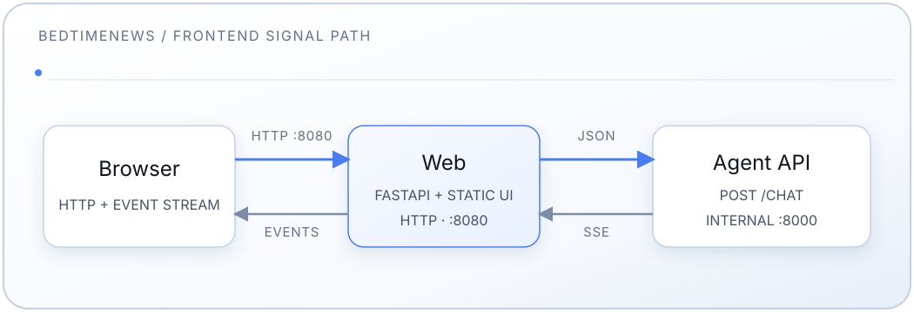

# Servicio Frontend

[中文](README.md) | [English](README.en.md) | [Español](README.es-ES.md)

Frontend web personalizado para la base de conocimiento de BedtimeNews: una
aplicación de página única estática (HTML/CSS/JS) que aloja tanto el agente de
chat como el archivo de transcripciones dentro del sitio. Una pequeña
aplicación FastAPI la sirve y hace proxy del flujo de chat y de las APIs de
transcripciones al backend agente interno; la lista y el lector de
transcripciones viven en el mismo origen bajo `/transcripts`.

Consulta el [README principal](../README.es-ES.md) para la configuración
completa de la pila.

## Diseño

- **Tema:** paleta plana tipo chatbot (aspecto por defecto similar a
  ChatGPT/Claude) — oscuro `#212121` / claro `#ffffff`, un único acento verde
  `--accent`, sin degradados de fondo ni acentos decorativos dobles.
  Claro/oscuro siguen `prefers-color-scheme` por defecto; el interruptor SVG
  sol/luna del encabezado escribe una anulación en `sessionStorage`
  (sobrevive al recargar, se reinicia en una pestaña nueva).
- **Tokens de color** semánticos (`--bg`, `--surface`, `--line`, `--text`,
  `--text-dim`, `--muted`, `--accent`, `--user-bubble`, …), definidos para
  oscuro en `:root` y sobrescritos bajo `[data-theme="light"]`.
- **Tipografía:** pila sans CJK del sistema; monoespaciada solo para pocas
  etiquetas legibles por máquina. Sin CDN de webfonts.
- **Diseño (automático según el viewport; sin cambio manual
  escritorio/móvil):**
  - **Escritorio (>900px):** aterrizaje centrado en el chat; al abrir una
    transcripción se incorpora un panel de lectura a la derecha. El encabezado
    muestra chips de canal (睡前消息 / 参考信息 / …) y controles de GitHub y
    tema enmarcados (esquinas redondeadas). Inicios: una pregunta por
    categoría más un control「浏览文稿」debajo.
  - **Móvil (≤900px):** chat **o** archivo/lector a pantalla completa, de
    forma mutuamente excluyente; las pestañas inferiores「对话 | 文稿」dividen
    la barra por la mitad. Los inicios son ocho preguntas planas (sin
    etiquetas de categoría, sin botón de exploración — se usa la pestaña de
    archivo). Los iconos del encabezado no tienen borde; el control de
    edición de GitHub es solo de escritorio.
- **Cromado de lectura:** ranuras de altura fija (atrás / editar / cerrar)
  para que las líneas divisorias de lista↔artículo no salten al cambiar de
  vista; las líneas de regla de encabezados/`h2`/notas al pie dentro del
  artículo se suprimen.
- **Registro de adquisición de señales:** las etapas RAG (condense → … →
  generate) se muestran en vivo y se bloquean y colapsan cuando comienza la
  respuesta.

## Características

- Chat anónimo (sin autenticación)
- Tema claro/oscuro consciente del sistema con interruptor SVG
- Preguntas de muestra (por categoría en escritorio, planas en móvil) y
  「浏览文稿」 en escritorio
- Chips de canal, listas de archivo ordenadas de más nueva a más vieja (sin
  fecha al final), lector de artículos
- Enlace de edición de GitHub en escritorio hacia
  `BedtimeNews-Transcripts/edit/main/contents/…`
- Streaming SSE en tiempo real con pasos del pipeline visibles
- Respuestas en Markdown vía markdown-it incluido localmente (`html:false`)
  y navegación de citas dentro de la aplicación
- Conversación efímera, dentro de la página (se borra al refrescar)
- Accesible por teclado; respeta `prefers-reduced-motion`

## Arquitectura



El frontend:

- Se ejecuta en un contenedor Docker que sirve HTTP puro en el puerto 8080
  (sin TLS — la exposición pública y la terminación TLS se gestionan fuera de
  este repositorio)
- Es el único servicio publicado al host (`FRONTEND_PORT`, por defecto 8080)
- Hace proxy de `/chat` y de las APIs de transcripciones al agente a través
  de la red interna de Docker; el agente nunca se expone al host

## Componentes

- **server.py** — aplicación FastAPI: sirve `static/`, renderiza en el
  servidor la página de inicio, las de programa y las de transcripción, expone
  `/api/starters`, proxy de las APIs de transcripciones, proxy del SSE de
  `/chat`, robots/sitemap/enlaces cortos y endpoints de salud
- **starters.py** — datos de preguntas de muestra (categorías + preguntas)
- **static/index.html** — marcado de la página, script de arranque de tema,
  barra de pestañas móvil, plantillas de turnos
- **static/styles.css** — tokens de color planos y diseño escritorio/móvil
- **static/app.js** — enrutado, archivo/lector, inicios, compositor, tema,
  SSE, Markdown
- **static/markdown-it.min.js** — renderizador Markdown incluido localmente
  (MIT), cargado bajo demanda
- **static/bedtimenews.webp** — favicon / logo de marca
- **static/BingSiteAuth.xml** — verificación del sitio para Bing Webmaster Tools
- **pyproject.toml** — dependencias (`fastapi`, `uvicorn`, `httpx`)

## Endpoints

| Método | Ruta                                  | Propósito                                        |
| ------ | ------------------------------------- | ------------------------------------------------ |
| GET    | `/`                                   | Inicio: el armazón de la SPA (`static/index.html`) con metadatos canónicos/SEO |
| GET    | `/transcripts?channel={channel}`      | Lista de un programa renderizada en el servidor (`/transcripts` sin programa: `308` a `/`) |
| GET    | `/transcripts/{doc_id}`               | Página de transcripción renderizada en el servidor |
| GET    | `/api/starters`                       | JSON de preguntas de muestra (`categories`)      |
| GET    | `/api/transcripts`                    | Índice de transcripciones (proxy)                |
| GET    | `/api/transcripts/{doc_id}`           | Una transcripción (proxy; un `doc_id` mal formado da `404` sin llamar al agente) |
| POST   | `/chat`                               | Hace proxy del flujo SSE del agente al navegador (cuerpo de más de 128 KiB: `413`) |
| GET    | `/healthz`                            | Vitalidad de `web` por sí solo (nunca llama al agente): `status`, `version`, `instance` |
| GET    | `/readyz`                             | Disponibilidad de esta instancia: código de estado del `/health` del agente (200 / 503), cuerpo recortado |
| GET    | `/index.html`                         | Redirección `308` a `/`                          |
| GET    | `/robots.txt`                         | Permite todo; apunta al sitemap                  |
| GET    | `/sitemap.xml`                        | Inicio, listas por programa y cada transcripción |
| GET    | `/s/{short_id}`                       | Enlace corto, `302` a la transcripción           |

## Flujo de Desarrollo

El contenedor ejecuta `uvicorn server:app`. Tras cambiar archivos Python o
estáticos, reconstruye y reinicia:

```bash
# El frontend se publica en el host (FRONTEND_PORT, por defecto 8080)
docker compose build web
docker compose up -d web
open http://localhost:8080
```

> Usa `--no-cache` si una reconstrucción parece servir código obsoleto.

### Ejecutar sin Docker

```bash
cd frontend
pip install .
# Apunta a un backend agente alcanzable:
AGENT_BACKEND_HOST=localhost AGENT_BACKEND_PORT=8000 \
  uvicorn server:app --reload --port 8080
```

### Personalización

- **Preguntas de inicio / categorías:** edita `starters.py` (`CATEGORIES`).
- **Estilos:** edita `static/styles.css` (los tokens de diseño viven en
  `:root`).
- **Textos / disposición:** edita `static/index.html`.
- **Logo / favicon:** reemplaza `static/bedtimenews.webp`. Se renderiza a
  unos 1.85rem, así que mantenlo pequeño — 128px cuadrados bastan para
  hi-DPI, y el archivo queda cacheado una semana por `CachedStaticFiles`.

## Configuración

| Variable             | Por defecto | Propósito                                    |
| -------------------- | ----------- | -------------------------------------------- |
| `AGENT_BACKEND_HOST` | `agent`     | Nombre del servicio agente en la red Docker  |
| `AGENT_BACKEND_PORT` | `8000`      | Puerto del agente                            |
| `APP_PORT` / `FRONTEND_PORT` | `8080` | Puerto del host donde se publica el frontend: `APP_PORT` por instancia (blue-green), o `FRONTEND_PORT` de `.env` si no se define |
| `APP_VERSION`        | (vacío)     | Versión en la cabecera y en `/healthz`; compose la toma de `APP_IMAGE_TAG`, o de `IMAGE_TAG` si no se define (`latest`/vacío recurre a la versión del paquete) |
| `APP_INSTANCE`       | `local`     | Etiqueta de instancia que informa `/healthz` (el nombre del proyecto compose en despliegues blue-green) |
| `PUBLIC_BASE_URL`    | `https://bedtime.blog` | Origen de las URL canónicas, del sitemap y de robots |

### Endpoints de salud

Ambos son públicos a través del proxy de borde, como cualquier otra ruta:

- `GET /healthz` lo responde `web` por sí solo y nunca llama al agente:
  `{"status":"ok","version":"0.4.0","instance":"bedtimenews-app-green"}`. Que el
  agente o la base de datos fallen no debe hacer que un orquestador reinicie `web`.
- `GET /readyz` llama al `/health` del agente de esta instancia (3 s de
  timeout) y devuelve su código de estado: 200 si el agente alcanza la base de
  datos y sirve un snapshot, si no 503. El cuerpo se recorta a `ready`,
  `reason` (si no está listo) y el `id`, `format_version` y `embedding_space`
  del snapshot; el cuerpo completo del agente, que incluye el último error del
  indexador, nunca se reenvía. Las herramientas de despliegue deciden el
  cambio de tráfico con él.

El archivo compose comprueba la salud de `web` con `/healthz` (con `urllib` de
Python: la imagen no incluye `curl`).

### Endurecimiento

- Solo se sirven las rutas de la tabla y los archivos de `static/`: `/docs`, `/redoc` y `/openapi.json` de
  FastAPI están desactivados, y el proxy de transcripciones solo reenvía una
  URI de transcripción validada, de modo que ningún otro endpoint del agente es
  accesible desde fuera.
- `/chat` lee como máximo 128 KiB de cuerpo (`413` si se supera); el agente
  valida los límites de la pregunta y del historial.
- Los fallos del upstream llegan al navegador como un mensaje genérico; los
  detalles solo se registran en el log.
- Cada respuesta lleva Content-Security-Policy (`frame-ancestors 'none'`,
  `object-src 'none'`, `base-uri 'none'`, ...), `X-Content-Type-Options`,
  `X-Frame-Options` y `Referrer-Policy`.

### Parada ordenada

Con SIGTERM, uvicorn deja de aceptar conexiones y permite que las peticiones en
curso, incluido un `/chat` en streaming (como mucho el límite de 240 s del
agente), terminen durante hasta 270 s; el `stop_grace_period` de compose es de
300 s. Por eso un `docker compose stop` o una recreación en el sitio espera
hasta 5 minutos mientras haya un stream abierto.

## Depuración

```bash
# Logs
docker compose logs -f web
# Los nombres de contenedor siguen al proyecto compose (p. ej. bedtimenews-app-green-web-1);
# usa el nombre del servicio:
docker compose ps web
curl -s localhost:8080/readyz

# Conectividad del backend desde dentro del contenedor (la imagen slim no
# tiene ping/curl; usa el Python + httpx incluidos en su lugar)
docker compose exec web python -c "import httpx; print(httpx.post(
    'http://agent:8000/chat', json={'question': '测试'}, timeout=120).text)"
```

## Contrato de API

El frontend hace proxy del endpoint `/chat` del agente.

### Solicitud

```json
{
  "question": "string (required)",
  "history": [{"question": "…", "answer": "…", "grounded": true}],
  "stream": true
}
```

`history` es opcional; el navegador envía como máximo sus tres turnos más
recientes.

### Respuesta en streaming (SSE)

```json
{"type": "step", "step": "condense|route|rewrite|retrieve|grade|generate", "content": "…"}
{"type": "citations", "urls": {"ShuiQianXiaoXi/0501-0600/0588.md": {"title": "睡前消息588", "url": "/transcripts/ShuiQianXiaoXi/0501-0600/0588.md"}}}
{"type": "answer_chunk", "content": "…"}
{"type": "answer_final", "content": "…", "grounded": true}
{"type": "answer_meta", "grounded": true}
{"type": "followups", "items": ["…"]}
{"type": "error", "content": "…"}
```

El servidor puede emitir comentarios SSE `: ping` entre eventos y termina
cada flujo con `data: [DONE]`. Un turno exitoso envía exactamente uno de
`answer_final` o `answer_meta`. Las URLs de cita son rutas dentro de la
aplicación `/transcripts/…` (no GitHub Pages).

## Limitaciones (MVP)

- **Sin autenticación** — solo anónimo
- **Sin persistencia** — la conversación se borra al refrescar
- **Sesión por pestaña** — sin historial entre pestañas ni del lado del
  servidor

## Solución de Problemas

**Puerto 8080 en uso:** establece `FRONTEND_PORT` en `.env` a otro puerto del
host y recrea el servicio (`docker compose up -d web`).

**No se puede conectar al backend:**

- `docker compose ps agent` y `docker compose logs agent`
- Comprobación de conectividad desde dentro del contenedor (consulta
  [Depuración](#depuración))

**Los cambios no aparecen:** reconstruye (`--no-cache`) y recarga forzadamente
el navegador (Cmd/Ctrl+Shift+R).
