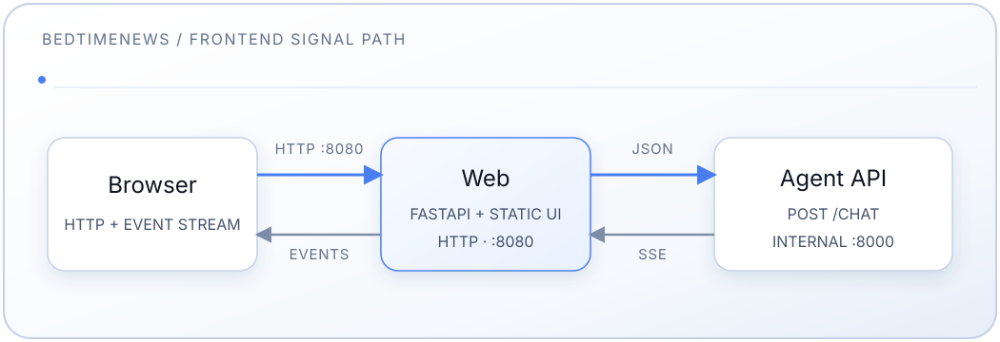

# Frontend 服务

[中文](README.md) | [English](README.en.md) | [Español](README.es-ES.md)

睡前消息知识库的自定义 Web 前端：聊天问答与站内文稿阅读一体的单页应用
（HTML/CSS/JS），由轻量 FastAPI 服务托管，并将聊天流与文稿 API 代理到内部
agent 后端；文稿列表与正文阅读器同源托管于 `/transcripts`。

全栈安装说明参见[主 README](../README.md)。

## 设计

- **主题：** 纯色 chatbot 配色（近 ChatGPT / Claude 默认观感）——深色底
  `#212121`、浅色底 `#ffffff`，单一绿色主强调色 `--accent`，无背景渐变、
  无双强调色装饰。浅/深默认跟随 `prefers-color-scheme`；页头 SVG 太阳/
  月亮切换写入 `sessionStorage`（刷新保留，新开标签回到系统偏好）。
- **颜色令牌**语义化、可换肤（`--bg`、`--surface`、`--line`、`--text`、
  `--text-dim`、`--muted`、`--accent`、`--user-bubble` 等），深色在
  `:root`，浅色在 `[data-theme="light"]`。
- **字体：** 系统 CJK 无衬线栈；等宽仅用于少量机器标签。不加载 webfont CDN。
- **布局（自动按视口宽度，无手动切换）：**
  - **桌面（>900px）：** 对话居中；打开文稿时右侧挤出阅读栏（双栏）。
    页头显示栏目 chips（睡前消息 / 参考信息 / …）、GitHub 与主题按钮
    （圆角方框）。示例区按 8 类各 1 题，下方有「浏览文稿」入口。
  - **手机（≤900px）：** 对话与文稿全屏互斥；底栏「对话 | 文稿」左右半分。
    示例区不显示类名，仅 8 个 starter；无「浏览文稿」按钮（用底栏文稿）。
    页头图标无边框；Edit 链接仅桌面显示。
- **阅读栏：** 固定高度槽位（返回 / Edit / 关闭），列表↔正文切换时顶部分割线
  不跳动；正文内不渲染标题/`h2`/脚注分隔横线。
- **信号采集日志：** RAG 阶段（condense → … → generate）实时显示，回答开始后
  锁定并折叠。

## 功能

- 匿名聊天（无需登录）
- 系统感知浅/深主题 + SVG 手动切换
- 示例问题（桌面按类、手机扁平）与桌面「浏览文稿」
- 栏目 chips + 文稿列表（发布时间新→旧，无日期沉底）+ 正文阅读
- 桌面文稿页 GitHub Edit（指向 Transcripts 仓库 `edit/main/contents/…`）
- 实时 SSE 流式输出与可见流水线步骤
- markdown-it 渲染回答（本地内置，`html:false`）与应用内引用跳转
- 会话仅存当前页（刷新清空）
- 键盘可用；尊重 `prefers-reduced-motion`

## 架构



Frontend：

- 运行在 Docker 容器中，通过纯 HTTP 对外提供服务，端口 8080（无 TLS——
  公网暴露与 TLS 终止由本仓库之外处理）
- 是唯一发布到宿主机的服务（`FRONTEND_PORT`，默认 8080）
- 通过内部 Docker 网络将 `/chat` 与文稿 API 代理给 agent；agent 从不暴露给宿主机

## 组件

- **server.py** — FastAPI：托管 `static/`、`/api/starters`、文稿 API 代理、
  `/chat` SSE 代理、SPA 的 `/transcripts` 路由
- **starters.py** — 示例问题数据（类别 + 问题）
- **static/index.html** — 标记、主题引导脚本、底栏 tab、对话模板
- **static/styles.css** — 纯色设计令牌与桌面/手机布局
- **static/app.js** — 路由、栏目/列表/正文、示例、composer、主题、SSE、Markdown
- **static/markdown-it.min.js** — 本地 Markdown 渲染器（MIT），按需加载
- **static/bedtimenews.webp** — favicon / 品牌 logo
- **pyproject.toml** — 依赖（`fastapi`、`uvicorn`、`httpx`）

## 端点

| 方法 | 路径                                  | 用途                           |
| ---- | ------------------------------------- | ------------------------------ |
| GET  | `/`                                   | SPA（`static/index.html`）     |
| GET  | `/transcripts`、`/transcripts/{path}` | 同上（浏览器路由）             |
| GET  | `/api/starters`                       | 示例问题 JSON（`categories`）  |
| GET  | `/api/transcripts`                    | 文稿索引（代理 agent）         |
| GET  | `/api/transcripts/{doc_id}`           | 单篇文稿（代理 agent）         |
| POST | `/chat`                               | 将 agent 的 SSE 流代理给浏览器 |
| GET  | `/healthz`                            | 存活检查                       |
| GET  | `/index.html`                         | `308` 重定向到 `/`             |
| GET  | `/robots.txt`                         | 允许全部抓取，并指向 sitemap   |
| GET  | `/sitemap.xml`                        | 首页、各栏目列表及全部文稿     |
| GET  | `/s/{short_id}`                       | 短链接，`302` 跳转到文稿       |

## 开发流程

容器运行 `uvicorn server:app`。修改 Python 或静态文件后，重新构建并
重启：

```bash
# Frontend 发布在宿主机上（FRONTEND_PORT，默认 8080）
docker compose build web
docker compose up -d web
open http://localhost:8080
```

> 如果重新构建后似乎仍在提供旧代码，使用 `--no-cache`。

### 不使用 Docker 运行

```bash
cd frontend
pip install .
# 指向一个可达的 agent 后端：
AGENT_BACKEND_HOST=localhost AGENT_BACKEND_PORT=8000 \
  uvicorn server:app --reload --port 8080
```

### 自定义

- **示例问题 / 类别：** 编辑 `starters.py`（`CATEGORIES`）。
- **样式：** 编辑 `static/styles.css`（设计令牌位于 `:root`）。
- **文案 / 布局：** 编辑 `static/index.html`。
- **Logo / favicon：** 替换 `static/bedtimenews.webp`。它以约 1.85rem 渲染，
  保持小体积即可——128px 见方足以覆盖 hi-DPI，且该文件被
  `CachedStaticFiles` 缓存一周。

## 配置

| 变量                 | 默认值  | 用途                         |
| -------------------- | ------- | ---------------------------- |
| `AGENT_BACKEND_HOST` | `agent` | Docker 网络上的 agent 服务名 |
| `AGENT_BACKEND_PORT` | `8000`  | Agent 端口                   |
| `FRONTEND_PORT`      | `8080`  | Frontend 发布到的宿主机端口  |
| `APP_VERSION`        | （空）  | 页头显示的版本；compose 取自 `IMAGE_TAG`（`latest`/空时回退为包版本） |
| `PUBLIC_BASE_URL`    | `https://bedtime.blog` | canonical、sitemap 与 robots 中 URL 的源站 |

## 调试

```bash
# 日志
docker compose logs -f web

# 从容器内检查后端连通性（slim 镜像没有 ping/curl；
# 用自带的 Python + httpx 代替）
docker compose exec web python -c "import httpx; print(httpx.post(
    'http://agent:8000/chat', json={'question': '测试'}, timeout=120).text)"
```

## API 契约

Frontend 代理 agent 的 `/chat` 端点。

### 请求

```json
{
  "question": "string (required)",
  "history": [{"question": "…", "answer": "…", "grounded": true}],
  "stream": true
}
```

`history` 可选；浏览器最多发送最近三轮对话。

### 流式响应（SSE）

```json
{"type": "step", "step": "condense|route|rewrite|retrieve|grade|generate", "content": "…"}
{"type": "citations", "urls": {"ShuiQianXiaoXi/0501-0600/0588.md": {"title": "睡前消息588", "url": "/transcripts/ShuiQianXiaoXi/0501-0600/0588.md"}}}
{"type": "answer_chunk", "content": "…"}
{"type": "answer_final", "content": "…", "grounded": true}
{"type": "answer_meta", "grounded": true}
{"type": "followups", "items": ["…"]}
{"type": "error", "content": "…"}
```

服务器可能在事件之间发送 `: ping` SSE 注释，并以 `data: [DONE]` 结束每条
流。成功的一轮恰好发送 `answer_final` 或 `answer_meta` 之一。引用 URL 为
应用内路径 `/transcripts/…`（不是 GitHub Pages）。

## 限制（MVP）

- **无鉴权** — 仅匿名使用
- **无持久化** — 刷新即清空会话
- **会话仅限单标签页** — 没有跨标签页或服务端历史

## 故障排查

**8080 端口被占用：** 在 `.env` 中把 `FRONTEND_PORT` 设为其它宿主机端口，
并重建服务（`docker compose up -d web`）。

**无法连接后端：**

- `docker compose ps agent` 与 `docker compose logs agent`
- 从容器内检查连通性（见[调试](#调试)）

**修改未生效：** 重新构建（`--no-cache`）并强制刷新浏览器
（Cmd/Ctrl+Shift+R）。
