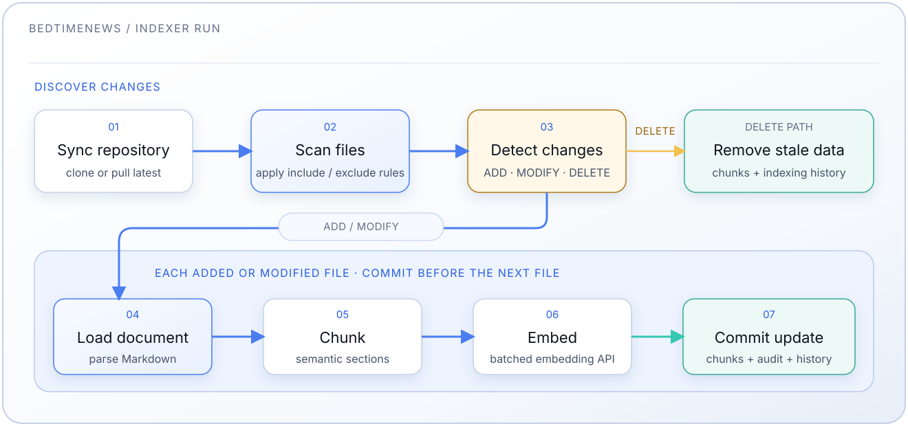

# Servicio Indexador

[中文](README.md) | [English](README.en.md) | [Español](README.es-ES.md)

Pipeline automatizado de incrustación de documentos para el archivo de
BedtimeNews. Clona el repositorio, procesa archivos markdown, genera embeddings
y los almacena en PostgreSQL + pgvector.

Consulta el [README principal](../README.es-ES.md) para las instrucciones de
configuración.

## Características

- **Sincronización automática**: Clona/actualiza desde
  [BedtimeNews-Transcripts](https://github.com/BedtimeNewsStudio/BedtimeNews-Transcripts)
- **Procesamiento incremental consciente del cuerpo**: huellas SHA-256 separadas para el Markdown completo y para el texto normalizado de `## 正文` enviado a embeddings; los cambios solo en título, fecha o apéndice no llaman al proveedor
- **Ejecución programada**: Planificador en proceso con una expresión cron
  configurable (por defecto: cada hora)
- **Indexación solo del cuerpo**: se extrae únicamente el tramo entre `## 正文`
  y `## 附录`; se descartan la línea de título, la línea de metadatos
  `**发布日期**` y las notas de corrección del apéndice
- **URI como doc_id**: la ruta de la transcripción relativa a `contents/` (con
  `.md`) es su identificador
- **Títulos normalizados**: se analiza el `URI映射.md` de origen y se escribe la
  correspondencia URI → título en `rag.documents`
- **Fragmentación inteligente**: Fragmentación semántica consciente de Markdown
- **Embeddings por lotes**: Uso eficiente de la API de embeddings por lotes
- **Monitoreo**: Depurador y estadísticas integrados

## Fases del Pipeline



Los archivos añadidos o con el cuerpo modificado se fragmentan e incrustan antes de que una sola transacción sustituya sus chunks e historial; un fallo del proveedor conserva la versión anterior. Los cambios solo en la fuente actualizan el historial sin tocar vectores, y las eliminaciones son transaccionales.

## Configuración

### Programación Cron

Establece en `config.yml`:

```yaml
indexer_cron_schedule: "0 * * * *"    # Cada hora (por defecto)
# indexer_cron_schedule: "*/30 * * * *"  # Cada 30 minutos
# indexer_cron_schedule: "0 2 * * *"     # Diario a las 2 AM
```

### Modo de muestra local

`index_config.sample.yml` selecciona siete transcripciones deterministas. Solo se admite con `INDEXER_SCOPE=sample`, `INDEX_CONFIG_FILE=/app/index_config.sample.yml`, almacenamiento aislado y un `POSTGRES_DB` terminado en `_local`; el indexador rechaza cualquier otro destino. `docker-compose.sample.yml` aporta las sobreescrituras de servicios.

### Filtros de Documentos

Edita `index_config.yml`:

```yaml
# Patrones de inclusión (procesados primero)
# Se comparan con el URI de la transcripción: su ruta relativa a contents/,
# incluyendo el sufijo .md.
include:
  # 睡前消息
  - "ShuiQianXiaoXi/*/*.md"

  # 参考信息
  - "CanKaoXinXi/*/*.md"

  # 高见
  - "GaoJian/*/*.md"

  # 讲点黑话
  - "JiangDianHeiHua/*/*.md"

  # 产经破壁机 (con fecha desde 2026-09; archivos en la raíz de la sección)
  - "ChanJingPoBiJi/*.md"
  # 产经破壁机 (números heredados y especiales misc/, rutas de dos niveles)
  - "ChanJingPoBiJi/*/*.md"

# Patrones de exclusión (procesados después de la inclusión)
exclude:
  # Páginas de navegación por canal, no transcripciones
  - "*/INDEX.md"

# Reglas de validación de archivos
validation:
  # Tamaño mínimo de archivo en bytes (omite archivos vacíos o diminutos)
  min_file_size: 100

  # Tamaño máximo de archivo en bytes (omite archivos extremadamente grandes)
  max_file_size: 10485760 # 10 MB
```

## Utilidades de Depuración

### Probar Conexión

```bash
docker compose exec indexer python -m src.debugger test
```

### Ver Estadísticas

```bash
# Estadísticas de la base de datos
docker compose exec indexer python -m src.debugger stats

# Acciones de archivos recientes
docker compose exec indexer python -m src.debugger recent --limit 20

# Historial de indexación de todos los archivos
docker compose exec indexer python -m src.debugger history

# Historial de un archivo específico
docker compose exec indexer python -m src.debugger history ShuiQianXiaoXi/0901-1000/0960.md
```

### Inspeccionar Documentos

```bash
# Ver los chunks de un documento
docker compose exec indexer python -m src.debugger inspect ShuiQianXiaoXi/0901-1000/0960.md
```

### Ver Logs

```bash
# Logs de la ejecución programada más reciente
docker compose exec indexer python -m src.debugger logs

# Últimas 100 líneas
docker compose exec indexer python -m src.debugger logs --lines 100

# Todos los logs
docker compose exec indexer python -m src.debugger logs --all
```

### Ejecución Manual

```bash
# Ejecutar el pipeline manualmente (una vez)
docker compose exec indexer python -m src.pipeline
```

### Borrar Datos

```bash
# PELIGRO: Borrar todos los datos indexados
docker compose exec indexer python -m src.debugger clear
```

## Esquema de Base de Datos

El indexador gestiona cuatro tablas en el esquema `rag`:

**`rag.document_chunks`**: Almacena chunks con embeddings

- `chunk_id`: Identificador único (`{doc_id}:{chunk_index}`)
- `doc_id`: El URI de la transcripción, **incluyendo `.md`**, p. ej.
  `ShuiQianXiaoXi/0501-0600/0588.md`, idéntico a la clave usada por el
  `URI映射.md` de origen
- `chunk_index`: Índice basado en 0 dentro del documento
- `heading`: Encabezado de sección (si existe)
- `text`: Contenido del chunk
- `word_count`: Número de palabras
- `embedding`: Vector `halfvec(N)` — `N` proviene de `EMBEDDING_DIM`
  (`config.yml`), aplicado por `storage/postgres/init.sh` en la primera
  inicialización de la BD, y **debe igualar la dimensión de salida del modelo
  de embeddings** (por defecto `2560` para `Qwen/Qwen3-Embedding-4B`). Consulta
  [Cambiar el Modelo de Embedding](#cambiar-el-modelo-de-embedding). El
  **tipo** de columna está fijado intencionalmente a `halfvec` (no
  configurable): cabe cualquier modelo de hasta 4000 dimensiones — incluidos
  los modelos de menor dimensión de OpenAI — con la mitad del almacenamiento y
  una pérdida de recall despreciable, y los casts de inserción/consulta en
  `{agent,indexer}/src/vector_db.py` también usan `::halfvec`. Cambia el tipo
  solo para precisión float32 completa, >4000 dimensiones, o embeddings
  binarios/dispersos (también requiere cambiar la opclass del índice y esos
  casts).
- `created_at`: Marca de tiempo

**`rag.documents`**: URI → 标准化标题 (título normalizado)

- `doc_id`: URI de la transcripción (clave primaria, incluye `.md`)
- `title`: título normalizado, p. ej. `睡前消息588`
- `updated_at`: marca de tiempo

Los títulos provienen del `URI映射.md` de origen. Una regla general
(`{canal}/{carpeta}/{número}.md` → `{nombre chino del canal}{número sin ceros}`)
cubre la gran mayoría, pero 29 transcripciones —los especiales de `misc/`, los
números de episodio duplicados oficialmente, las ediciones negativas de
产经破壁机— no se pueden derivar con ninguna regla, así que ese archivo es la
fuente autoritativa. El agente hace LEFT JOIN sobre esta tabla al recuperar para
mostrar las citas con el título en lugar del URI. Cada ejecución refresca todos
los títulos, ya que el origen puede corregir un título sin tocar la
transcripción.

**`rag.indexing_history`**: estado de la representación indexada

- `file_path`: URI de la transcripción
- `source_hash`: SHA-256 del Markdown fuente completo
- `body_hash`: SHA-256 del cuerpo normalizado representado por chunks/vectores
- `body_normalization_version`: fuerza una reindexación al cambiar el normalizador
- `indexed_at`: última indexación correcta del cuerpo
- `source_observed_at`: última actualización aceptada de la fuente

**`rag.file_actions`**: registro de auditoría

- `action_type`: `ADD`, `MODIFY`, `SOURCE_ONLY` o `DELETE`
- `source_hash` / `body_hash`: huellas explícitas (`NULL` al eliminar)
- `run_timestamp` / `processed_at`: tiempos de registro y finalización

Los volúmenes v0.2 existentes deben aplicar `storage/postgres/migrations/001_body_hashes.sql` antes de arrancar el indexador nuevo. Las filas heredadas con `body_hash` nulo se reindexan una vez de forma conservadora. Para una actualización limpia: respalda PostgreSQL, aplica la migración, vacía las cuatro tablas RAG y vuelve a poblar el corpus. No ejecutes el indexador antiguo contra el esquema nuevo.

## Cambiar el Modelo de Embedding

Cambiar `embedding.model` (y su endpoint) en `config.yml` **no** es un
reemplazo directo. Debes re-incrustar todo el corpus, porque:

- Los vectores de modelos diferentes **no son comparables**, incluso con la
  misma dimensión — así que un cambio de modelo siempre requiere
  re-incrustación.
- Cada modelo emite una **dimensión fija** (p.ej. `Qwen/Qwen3-Embedding-4B` =
  2560, `text-embedding-3-small` = 1536, `text-embedding-3-large` = 3072,
  `text-embedding-004` = 768). La columna `embedding halfvec(N)` se dimensiona
  desde `EMBEDDING_DIM` (`.env`) mediante `storage/postgres/init.sh`. Si la
  dimensión del nuevo modelo difiere, **el tipo de columna en sí debe
  cambiar**, o las inserciones fallan con `expected N dimensions, not M`.
- `init.sh` se ejecuta **solo cuando Postgres inicializa un volumen de datos
  vacío**, y usa `CREATE TABLE IF NOT EXISTS`. Cambiar `EMBEDDING_DIM`
  después **no** altera una base de datos existente.

### Manual de Procedimiento

```bash
# 1. Detener servicios
docker compose down

# 2. Edita config.yml: actualiza el grupo embedding (model / base_url / api_key).

# 3. Busca la dimensión de salida del nuevo modelo (docs del proveedor), llámala N.

# 4. Establece EMBEDDING_DIM=N en .env (init.sh dimensiona la columna desde ello en una init fresca).
```

Luego aplica la dimensión a la base de datos — elige una:

**Opción A — recrear el volumen (lo más simple; borra la BD para que `init.sh`
se vuelva a ejecutar):**

Los datos de Postgres viven en un **bind mount**
(`./storage/postgres/volume`), así que `docker compose down -v` NO lo limpia —
debes eliminar el contenido del directorio tú mismo. Muévelo a un lado
(reversible) en lugar de borrarlo directamente:

```bash
docker compose down
mv storage/postgres/volume storage/postgres/volume.bak   # punto de reversión reversible
docker compose up -d postgres   # init.sh se ejecuta fresco, dimensionando la columna desde EMBEDDING_DIM
# La BD está ahora vacía, así que la detección de cambios trata cada archivo
# como nuevo (paso 6 opcional).
# Una vez verificada la re-incrustación, elimina la copia: rm -rf storage/postgres/volume.bak
```

**Opción B — alterar la tabla existente in situ (conserva las demás tablas):**

```bash
docker compose up -d postgres
docker compose exec postgres psql -U "$POSTGRES_USER" -d "$POSTGRES_DB" -c "
  DROP INDEX IF EXISTS rag.idx_embedding_hnsw;
  TRUNCATE rag.document_chunks;
  ALTER TABLE rag.document_chunks ALTER COLUMN embedding TYPE halfvec(N);
  CREATE INDEX idx_embedding_hnsw ON rag.document_chunks
    USING hnsw (embedding halfvec_cosine_ops);
"
```

Termina re-incrustando:

```bash
# 6. Restablece el estado de detección de cambios para que el indexador
#    re-incruste todo.
#    OBLIGATORIO tras la Opción B (indexing_history aún guarda hashes antiguos,
#    o el indexador verá "sin cambios" y saltará). Inofensivo tras la Opción A.
docker compose up -d indexer
docker compose exec indexer python -m src.debugger clear --force

# 7. Re-incrustar el corpus completo
docker compose exec indexer python -m src.pipeline

# 8. Verificar dimensión + número de filas
docker compose exec postgres psql -U "$POSTGRES_USER" -d "$POSTGRES_DB" \
  -c "\d rag.document_chunks" | grep embedding
docker compose exec indexer python -m src.debugger stats
```

> `debugger clear` trunca `document_chunks`, `indexing_history` y
> `file_actions`, y elimina el clon local de contenido (se vuelve a clonar en
> la siguiente ejecución).

## Copia de Seguridad y Restauración de Datos

El volumen de datos de PostgreSQL se almacena en un directorio gitignored del
código. Puedes respaldar y restaurar toda la base de datos con archivos tar
estándar.

### Respaldo de Datos PostgreSQL

**Requisitos previos**: Detén todos los servicios para garantizar la
consistencia de los datos:

```bash
docker compose down
```

**(Opcional) Comprobar el tamaño del volumen (sin comprimir)**:

```bash
du -h -d 0 storage/postgres/volume
```

**Crear copia de seguridad**:

```bash
# Crear archivo de respaldo con marca de tiempo
tar czf /path/to/backup/postgres-volume-$(date +%F).tar.gz storage/postgres/volume/

# Salida de ejemplo: /path/to/backup/postgres-volume-2025-11-27.tar.gz
```

La copia de seguridad incluye:

- Todos los chunks de documentos indexados y embeddings
- Historial de indexación y acciones de archivos
- Configuración y metadatos de la base de datos

### Restaurar Datos PostgreSQL

**Requisitos previos**: Detén todos los servicios:

```bash
docker compose down
```

**Restaurar desde la copia de seguridad**:

```bash
# Eliminar datos existentes (si los hay)
rm -rf storage/postgres/volume

# Extraer la copia al directorio de datos de postgres (ejecuta en la raíz del proyecto)
tar xzf /path/to/backup/postgres-volume-2025-11-27.tar.gz -C .
# Verifica que los archivos se extrajeron como ./storage/postgres/volume/18/docker/...

# Iniciar servicios
docker compose up -d
```

**Verificar la restauración**:

```bash
# Comprobar estadísticas de la base de datos
docker compose exec indexer python -m src.debugger stats

# Ver acciones de archivos recientes
docker compose exec indexer python -m src.debugger recent --limit 10
```

### Notas

- **Solo local**: El directorio de datos de postgres está en `.gitignore` y no
  se rastrea por control de versiones
- **Migración**: Las copias de seguridad son portables y pueden restaurarse en
  diferentes máquinas
- **Espacio en disco**: Cada copia suele oscilar entre 100MB y varios GB según
  el contenido indexado

## Estructura del Proyecto

```plaintext
indexer/src/
├── entrypoint.py        # Punto de entrada principal
├── pipeline.py          # Orquestación del pipeline de indexación
├── scheduler.py         # Planificador cron
├── git_sync.py          # Sincronización de repositorio
├── file_scanner.py      # Escaneo del sistema de archivos
├── document_loader.py   # Procesamiento de Markdown
├── change_detector.py   # Comparación de hash de contenido
├── chunker.py           # Fragmentación semántica
├── embeddings.py        # Generación de embeddings (abstracción de proveedor)
├── vector_db.py         # Operaciones de base de datos
├── debugger.py          # Utilidades de depuración
├── stats.py             # Cálculo de estadísticas
├── models.py            # Modelos de datos
├── paths.py             # Gestión de rutas
└── settings.py          # Configuración
```

## Monitoreo

### Comprobar Estado del Servicio

```bash
# Ver logs
docker compose logs -f indexer

# Comprobar el proceso del planificador sin privilegios
docker compose top indexer

# Verificar que la base de datos tiene documentos
docker compose exec indexer python -m src.debugger stats
```

### Salida Esperada

Tras la primera ejecución deberías ver:

- Repositorio clonado en `indexer/data/BedtimeNews-Transcripts/`
- Chunks en `rag.document_chunks`
- Acciones de archivos registradas en `rag.file_actions`

### Métricas de Rendimiento

El pipeline muestra tras cada ejecución:

- Total de documentos procesados
- Total de chunks creados
- Total de tokens procesados
- Promedio de tokens por chunk
- Llamadas estimadas a la API de embeddings

## Solución de Problemas

**No se indexó ningún documento:**

```bash
# Comprobar errores en los logs
docker compose logs indexer | grep -i error

# Ejecutar el pipeline manualmente
docker compose exec indexer python -m src.pipeline

# Verificar que el git clone tuvo éxito
docker compose exec indexer ls -la data/BedtimeNews-Transcripts/
```

**Errores de la API de embeddings:**

- Comprueba la clave API del proveedor de embeddings (p.ej.
  `embedding.api_key`) en `config.yml`
- Verifica que no se excedan los límites de velocidad
- Consulta el uso de la API en el panel del proveedor
- `expected N dimensions, not M`: la dimensión de salida del modelo no
  coincide con la columna `embedding halfvec(N)` (dimensionada desde
  `EMBEDDING_DIM`) — consulta
  [Cambiar el Modelo de Embedding](#cambiar-el-modelo-de-embedding)

**Conexión a la base de datos fallida:**

- Asegúrate de que postgres esté en ejecución: `docker compose ps postgres`
- Comprueba las credenciales en `config.yml`
- Prueba la conexión: `docker compose exec indexer python -m src.debugger test`

**El planificador no se ejecuta:**

```bash
# Comprobar el proceso del planificador
docker compose top indexer

# Ver logs de ejecuciones programadas
docker compose exec indexer python -m src.debugger logs

# Reiniciar el servicio
docker compose restart indexer
```
