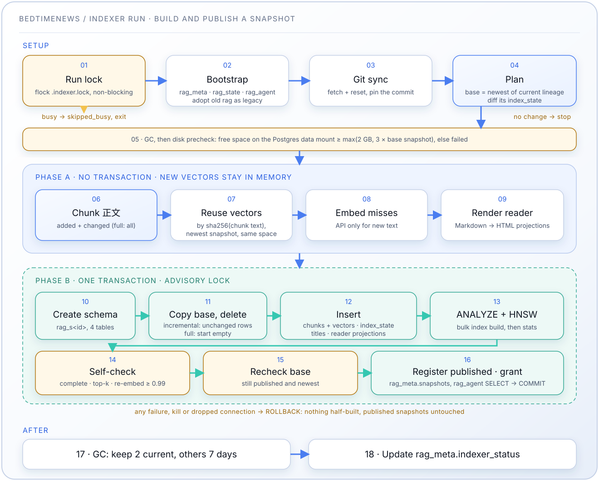

# Indexer 服务

[中文](README.md) | [English](README.en.md) | [Español](README.es-ES.md)

睡前消息档案库的自动化文档 embedding 流水线。克隆文稿仓库，对文稿分块并生成 embedding，再以**不可变、带版本的快照**发布到 PostgreSQL + pgvector，供 Agent 读取。Indexer 是数据库唯一的写入方。

安装与配置说明参见[主 README](../README.md)，完整设计依据参见[设计文档](../docs/designs/20261007_rag-snapshot-architecture.md)。

## 功能

- **自动同步**：从 [BedtimeNews-Transcripts](https://github.com/BedtimeNewsStudio/BedtimeNews-Transcripts) 克隆/更新；每次构建固定在开始时取得的 commit 上
- **快照发布**：每次构建产出一个完整、自洽的 schema `rag_s<id>`，发布后不再修改。发布是原子的（单个事务）、可回退的（`retire`），并登记在注册表中；Agent 在 15 秒内切换到新快照，无需重启
- **增量构建**：把文稿与最新快照的 `index_state` 逐一比对，分别记录完整 Markdown 与实际送入 embedding 的规范化 `## 正文` 的 SHA256。未变化的文稿直接从基础快照复制；仅标题、日期或附录变化时不调用 embedding
- **按分块文本复用向量**：以 `sha256(分块文本)` 从同一向量空间的最新快照复用向量，因此全量构建（分块或规范化规则变化、格式升级、接管旧数据之后）只为真正变化的文本调用 embedding
- **发布前自检**：完整性检查、抽样 HNSW 查询、抽样重新 embedding（余弦 ≥ 0.99），拦截有问题的构建
- **定时执行**：进程内调度器，支持可配置的 cron 表达式（默认：每小时）；超时的运行不补跑，运行锁防止并发运行
- **只索引正文**：每篇文稿只抽取 `## 正文` 到 `## 附录` 之间的内容，丢弃标题行、`**发布日期**` 元数据与附录的订正/核对记录
- **URI 作为 doc_id**：文稿相对 `contents/` 的路径（含 `.md`）即其标识
- **标准化标题**：解析上游 `URI映射.md`，把 URI → 标题写入快照的 `documents` 表
- **智能分块**：感知 markdown 的语义分块，`## 正文` 内每个小标题一节（第一个小标题之前的正文单独成节）；重叠只在同一节内延续，不跨越标题；不足 50 词的 chunk 丢弃
- **只读 Agent**：Indexer 维护 `rag_agent` 角色，该角色只能读取已发布的快照
- **可监控**：运行状态记录在 `rag_meta.indexer_status`（由 Agent 的 `/health` 暴露），并提供运维命令与调试工具

## 流水线阶段



一次运行：

1. **运行锁**：对 `/data/.indexer.lock`（即 `INDEXER_DATA_DIR` 挂载点）加非阻塞 `flock`。若已有其他运行持有该锁（定时运行、手动 `build` 或第二个容器），本次记录 `skipped_busy` 后退出，不触碰 git 目录和数据库。
2. **启动引导**（幂等）：创建 `rag_meta`、`rag_state` 与 `rag_agent` 角色；把已有的旧版 `rag` schema 接管为快照 `legacy`（见[从旧版 schema 升级](#从旧版-schema-升级)）。
3. **Git 同步**并固定 commit。
4. **规划**：增量基础是当前谱系（相同流水线指纹与向量空间）中最新发布的快照。把文稿与其 `index_state` 比对，得到新增、正文变化、仅源文件变化（标题/日期/附录）和删除的文稿，以及需要刷新的阅读器投影与标题。无变化 → `no_change`。没有基础（首次构建、版本号变化、新向量空间）或 `build --full` → 全量构建。
5. **先 GC，再做磁盘预检**：Postgres 数据所在文件系统的剩余空间必须 ≥ max(2 GB, 3 × 基础快照大小)，否则不构建。
6. **阶段 A**（事务外）：对需要（重新）索引的文稿分块；按分块文本哈希复用向量，只为未命中的分块调用 embedding API；渲染阅读器投影。新向量只保存在内存中。
7. **阶段 B**（单个事务，持有数据库 advisory lock）：创建 `rag_s<id>` → 复制基础快照的四张表（增量）→ 删除变化和已删除文稿的行 → 插入分块（复用的向量在服务端关联写入）→ 写入 `index_state`、标题和阅读器投影 → `ANALYZE` → 建 HNSW 索引 → 自检 → 复核基础快照仍为已发布且仍是其谱系中最新 → 登记为 `published` → 授予 `rag_agent` 读权限 → `COMMIT`。
8. **再次 GC**，然后更新 `rag_meta.indexer_status`。

任何失败、进程被杀或连接断开都会让阶段 B 的整个事务回滚：不会留下构建一半的 schema 或注册行，已发布的快照不受影响。收到 `SIGTERM` 时 Indexer 取消正在执行的语句并退出（compose 留出 30 秒）。

全量语料实测（1,902 篇文稿、13,434 个分块、2560 维；本地 4 核机器）：改动一篇文稿的增量构建约 19 秒（阶段 B 约 14 秒，主要是建 HNSW 索引）；复用全部向量的全量构建约 36 秒；每个快照约 240 MB，一次构建写入约 200 MB WAL。

## 配置

### Cron 调度

在 `config.yml` 中设置：

```yaml
indexer_cron_schedule: "0 * * * *"      # 每小时（默认）
# indexer_cron_schedule: "*/30 * * * *" # 每 30 分钟
# indexer_cron_schedule: "0 2 * * *"    # 每天凌晨 2 点
```

下次运行时间总是从当前时刻算起：一次运行超过调度间隔时，错过的时间点会被跳过，而不是接连补跑。错过的运行不会丢失变更，因为每次构建都与已发布的快照比对。

### 本地小样本模式

`index_config.sample.yml` 固定选择八篇文稿，覆盖普通期号、小数期号、`misc` 与多个栏目。仅可在 `INDEXER_SCOPE=sample`、`INDEX_CONFIG_FILE=/app/index_config.sample.yml`、隔离的数据目录以及以 `_local` 结尾的 `POSTGRES_DB` 下运行；否则 Indexer 会拒绝启动。`docker-compose.sample.yml` 提供服务覆盖配置。

### 文档过滤规则

编辑 `index_config.yml`：

```yaml
# 包含规则（先处理）
# 匹配对象是文稿的 URI —— 相对 contents/ 的路径，含 .md 后缀。
include:
  # 睡前消息
  - "ShuiQianXiaoXi/*/*.md"

  # 参考信息
  - "CanKaoXinXi/*/*.md"

  # 高见
  - "GaoJian/*/*.md"

  # 讲点黑话
  - "JiangDianHeiHua/*/*.md"

  # 产经破壁机（2026-09 起按发布日期命名，文稿位于栏目根目录）
  - "ChanJingPoBiJi/*.md"
  # 产经破壁机（历史编号期与 misc/ 特辑，两级路径）
  - "ChanJingPoBiJi/*/*.md"

# 排除规则（后处理）
exclude:
  # 各栏目的导航页，不是文稿
  - "*/INDEX.md"

# 文件校验规则
validation:
  # 最小文件大小（字节，跳过空文件或过小的文件）
  min_file_size: 100

  # 最大文件大小（字节，跳过超大文件）
  max_file_size: 10485760 # 10 MB
```

## 快照运维命令

在 indexer 容器内运行：

| 命令                                              | 作用                                                                     |
| ------------------------------------------------- | ------------------------------------------------------------------------ |
| `python -m src.snapshots list`                    | 列出快照：状态、是否固定、谱系（当前/其他）、发布时间、大小、向量空间    |
| `python -m src.snapshots status`                  | 显示 `rag_meta.indexer_status`（上次运行、结果、错误、连续失败次数）     |
| `python -m src.snapshots retire <id>`             | 退役快照（数据回滚）；Agent 在 15 秒内回退到上一个可读快照               |
| `python -m src.snapshots unretire <id>`           | 撤销退役（退役的快照保留 24 小时）                                       |
| `python -m src.snapshots pin <id>` / `unpin <id>` | 固定或取消固定；固定的快照永不被垃圾回收                                 |
| `python -m src.snapshots build [--full]`          | 立即构建，与定时运行使用同一运行锁和 advisory lock                       |

```bash
docker compose exec indexer python -m src.snapshots list
docker compose exec indexer python -m src.snapshots retire s20261007t091512z_a1b2c3d
```

## 调试工具

`stats`、`history`、`inspect` 读取当前快照（Indexer 当前谱系中最新发布的快照），其中 `history` 读取其 `index_state`；`recent` 读取审计日志 `rag_state.file_actions`。

### 测试连接

```bash
docker compose exec indexer python -m src.debugger test
```

### 查看统计

```bash
# 当前快照统计
docker compose exec indexer python -m src.debugger stats

# 最近的文件操作
docker compose exec indexer python -m src.debugger recent --limit 20

# 所有文件的索引历史
docker compose exec indexer python -m src.debugger history

# 指定文件的历史
docker compose exec indexer python -m src.debugger history ShuiQianXiaoXi/0901-1000/0960.md
```

### 查看文档

```bash
# 查看某篇文稿的 chunk
docker compose exec indexer python -m src.debugger inspect ShuiQianXiaoXi/0901-1000/0960.md
```

### 查看日志

```bash
# 最近的定时运行日志
docker compose exec indexer python -m src.debugger logs

# 最后 100 行
docker compose exec indexer python -m src.debugger logs --lines 100

# 全部日志
docker compose exec indexer python -m src.debugger logs --all
```

### 手动执行

```bash
# 立即构建一次（增量）
docker compose exec indexer python -m src.snapshots build

# 全部重建（仍按分块文本复用向量）
docker compose exec indexer python -m src.snapshots build --full
```

不再有“清空数据”命令：需要重建时用 `build --full`，回滚有问题的数据用 `retire`。

## 数据库结构

Indexer 是唯一的写入方，以下对象都由它在启动和构建时创建；`storage/postgres/init.sh` 只启用 `vector` 扩展。

```plaintext
rag_meta    快照注册表与 indexer 运行状态（只由 indexer 写入）
rag_state   indexer 私有：审计日志
rag_s<id>   只读快照：document_chunks / documents / transcripts / index_state
```

### `rag_s<id>`：一个快照

`<id>` 为 `s` + UTC 构建时间 + 文稿仓库 commit 前 7 位，例如 `s20261007t091512z_a1b2c3d`。快照发布后不再修改。表结构按 `format_version` 定义在 `src/snapshot_schema.py` 中。

**`document_chunks`**：带 embedding 的 chunk

- `chunk_id`：唯一标识，`{slug}_chunk_{index:03d}`，slug 为去掉 `.md`、`/` 替换为 `_` 的 URI（例如 `ShuiQianXiaoXi_0501-0600_0588_chunk_000`）
- `doc_id`：文稿 URI，**含 `.md`**，例如 `ShuiQianXiaoXi/0501-0600/0588.md`——与上游 `URI映射.md` 的键逐字节一致
- `chunk_index`：文稿内从 0 开始的序号
- `heading`：小节标题（如有）
- `text`：chunk 内容
- `word_count`：词数
- `embedding`：`halfvec(N)`，`N` 为该快照向量空间的维度。列**类型**固定为 `halfvec`：可容纳 4000 维以内的任意模型，存储减半、召回损失可忽略。HNSW 索引（`halfvec_cosine_ops`，pgvector 默认参数 `m=16`、`ef_construction=64`）支撑 Agent 的近邻检索
- `created_at`：时间戳
- `id`：每个快照重新生成的 `SERIAL` 键，任何地方都不得依赖它

**`documents`**：URI → 标准化标题

- `doc_id`：文稿 URI（主键，含 `.md`）
- `title`：标准化标题，例如 `睡前消息588`
- `updated_at`：时间戳

标题来自上游 `URI映射.md`。通则（`{栏目}/{百期}/{期号}.md` → `{栏目中文名}{去零期号}`）覆盖绝大多数文稿，但有 29 篇——`misc/` 特辑、官方重复的期号、产经破壁机的负数期——无法由规则推出，因此以该文件为准。Agent 检索时 LEFT JOIN 此表，用标题而不是原始 URI 渲染引用。由于上游可能只更正标题而不改动文稿，每次构建都会刷新全部标题。

**`transcripts`**：应用内阅读器使用的渲染文稿

- `doc_id`：文稿 URI（主键）
- `canonical_title` / `source_title`：标准化标题与文稿自身的 `# ` 标题
- `channel`、`publication_date`：栏目名与 `**发布日期**` 的值
- `body_html`：Agent 的 `/transcripts` API 返回的渲染页面
- `source_hash`、`projection_version`：重新渲染的触发条件（源文件修改或渲染器变化）

**`index_state`**：构建来源记录，作为下一次增量构建的基线（Agent 不读取）

- `file_path`：文稿 URI
- `source_hash`：完整原始 Markdown 的 SHA256
- `body_hash`：chunk 与向量所对应的规范化正文的 SHA256
- `body_normalization_version`：生成它的规范化版本
- `indexed_at`、`source_observed_at`：最近一次正文索引时间与最近一次接受的源文件变化时间

### `rag_meta`

**`snapshots`**：注册表。每个已提交的快照一行（`status` 为 `published` 或 `retired`；失败的构建不会出现）：`snapshot_id`、`schema_name`、`format_version`、`pipeline_fingerprint`、`embedding_space`、`embedding_model`、`embedding_dim`、`normalization_version`、`chunker_version`、`source_commit`、`base_snapshot_id`（增量构建）、`builder_version`、`pinned`、`published_at`、`retired_at`、`index_params`（HNSW 参数）与 `stats`（数量、新建与复用的 embedding、各步耗时）。

**`indexer_status`**：恰好一行：`last_run_at`、`last_result`（`published` / `no_change` / `skipped_busy` / `failed`）、`last_error`、`last_published_at`、`consecutive_failures`。

### `rag_state`

**`file_actions`**：只追加的审计日志，每次构建发布的每个文稿变化一行：`action_type`（`ADD`、`MODIFY`、`SOURCE_ONLY`、`DELETE`）、`source_hash` / `body_hash`（`DELETE` 为 `NULL`）、`run_timestamp` / `processed_at`。不参与服务，无需备份。

### 两个兼容性维度

| 维度                                | 组成                                                                                                                     | 作用                                                              |
| ----------------------------------- | ------------------------------------------------------------------------------------------------------------------------ | ----------------------------------------------------------------- |
| **流水线指纹**                      | (`format_version`、`normalization_version` = `BODY_NORMALIZATION_VERSION`、`chunker_version` = `CHUNKER_VERSION`) 的哈希 | 只有指纹相同的快照之间才能增量构建，否则全量构建                  |
| **向量空间** `embedding_space`      | `<模型>@<维度>`，例如 `Qwen/Qwen3-Embedding-4B@2560`；可用 `embedding.space_id` 覆盖                                     | 只在同一向量空间内复用向量，Agent 也只读取同一向量空间的快照      |

- 分块参数或逻辑变化时必须提升 `CHUNKER_VERSION`（`src/chunker.py`），规范化变化时必须提升 `BODY_NORMALIZATION_VERSION`（`src/document_loader.py`）。漏提会让新旧分块混在同一个快照里，代码评审需检查。
- Agent 读取的任何表或列的结构或含义变化时提升 `FORMAT_VERSION`（`src/snapshot_schema.py`），并把新格式加入 Agent 的 `SUPPORTED_FORMATS`。
- “谱系”指流水线指纹与向量空间都相同的一组快照。

### `rag_agent` 角色

Agent 以 `rag_agent` 连接，该角色只有 `rag_meta` 的 `USAGE` 及其两张表的 `SELECT`，以及已发布快照的 `USAGE` + `SELECT`——在发布事务内授予。它在任何地方都没有写权限。Indexer 每次启动都会确保该角色存在：设置了 `POSTGRES_AGENT_PASSWORD` 时赋予 `LOGIN` 并同步密码；未设置时为 `NOLOGIN`，Agent 回退到超级用户（并记录警告）。Indexer 自身继续使用超级用户。

### 垃圾回收

每次构建前后都运行 GC，每次删除在单独的事务中进行并持有 advisory lock（`lock_timeout` 5 秒；仍在被读取的快照留到下次运行再删）：

| 规则                                                                                          | 理由                                        |
| --------------------------------------------------------------------------------------------- | ------------------------------------------- |
| 当前谱系保留最新 2 个已发布快照                                                               | 当前快照加一个可即时回滚的目标              |
| 其他谱系（含 `legacy`）只保留各自最新 1 个，在被当前谱系取代后保留 7 天                       | 上一个代码版本仍可回滚                      |
| `pinned` 快照永不删除                                                                         | 显式长期固定                                |
| `retired` 快照保留 24 小时                                                                    | 误退役可以撤销                              |
| 被取代或退役后 10 分钟内的快照不删除                                                          | 保护进行中的请求（Agent 在 15 秒内切换）    |

## 从旧版 schema 升级

已有部署在快照版 Indexer 首次启动时被自动接管，无需手动步骤，也没有升级顺序要求：

1. 已有的 `rag` schema 登记为快照 `legacy`（格式 1，向量空间取自该列的实际维度与配置的模型）；`rag.file_actions` 移到 `rag_state`，`rag.indexing_history` 改名为 `rag.index_state`，并授予 `rag_agent` 对 `rag` 的读权限。
2. 第一次构建是新谱系中的全量构建，复用 `legacy` 的全部向量（通常不调用 embedding，耗时几分钟）。
3. 之后 `legacy` 再保留 7 天，旧版 Agent 继续可用，也可以用 `retire` 回滚数据。

接管后**不支持**把 Indexer 回滚到快照之前的版本（旧版会写入已改名的表并原地修改 `legacy`）。Agent 可以自由回滚，直到 `legacy` 被垃圾回收。早于 v0.3 的数据库需先执行 `storage/postgres/migrations/`（历史脚本）。

## 更换 Embedding 模型

不同模型的向量即使维度相同也**不可比较**，而且每个模型输出固定的维度（例如 `Qwen/Qwen3-Embedding-4B` = 2560、`text-embedding-3-small` = 1536、`text-embedding-3-large` = 3072）。因此换模型就是换一个向量空间，作为新快照构建，旧快照在此期间继续服务——无需停服、无需 `ALTER TABLE`、无需清空任何状态。

### 操作步骤

```bash
# 1. 编辑 config.yml 的 embedding 分组（model / base_url / api_key），
#    并把 .env 中的 EMBEDDING_DIM 设为新模型的输出维度。

# 2. 只重启 indexer。下一次构建看到新的向量空间，找不到增量基础，
#    于是全量构建并为整个语料生成 embedding（约 25 分钟）。旧快照继续为当前 Agent 服务。
docker compose up -d indexer
docker compose exec indexer python -m src.snapshots build   # 或等待定时运行

# 3. 确认新快照已在新向量空间中发布。
docker compose exec indexer python -m src.snapshots list

# 4. 用同样的配置重启 Agent：它会选择自身（新）向量空间中的快照。
#    单实例部署会短暂不可用。
docker compose up -d agent
docker compose exec agent curl -s localhost:8000/health
```

旧快照在 7 天内仍可读取，回滚只需恢复旧配置并重启 Agent。若模型不变、只是不想混用另一个提供方的向量，改为（在 indexer 与 agent 中一致地）设置 `embedding.space_id`。

## 数据备份与恢复

### 快照不是备份

所有快照都在同一个 Postgres 实例、同一块磁盘上；磁盘故障或误删数据目录会让它们一起丢失。

- **最坏情况可以重建**：所有数据都来自文稿 git 仓库，在空数据库上做一次全量构建即可恢复（一次完整的 embedding，约 25 分钟）。
- **可选：异地导出**最新快照（几百 MB）：

  ```bash
  docker compose exec postgres pg_dump -U "$POSTGRES_USER" -d "$POSTGRES_DB" -Fc \
    -n rag_s<id> -n rag_meta > rag-<id>.dump
  ```

  恢复时用 `pg_restore` 导入，并确认该快照在 `rag_meta.snapshots` 中的 `status = 'published'`。
- 审计日志 `rag_state.file_actions` 无需备份。

### 备份整个数据卷

PostgreSQL 数据卷存放在代码库中被 gitignore 的目录里，可以用标准 tar 归档备份和恢复整个数据库。

**前提**：停止所有服务以保证数据一致：

```bash
docker compose down
```

**（可选）查看数据卷大小（未压缩）**：

```bash
du -h -d 0 storage/postgres/volume
```

**创建备份**：

```bash
# 创建带时间戳的备份归档
tar czf /path/to/backup/postgres-volume-$(date +%F).tar.gz storage/postgres/volume/

# 示例输出：/path/to/backup/postgres-volume-2025-11-27.tar.gz
```

备份包含全部快照、注册表、审计日志与数据库配置。

**从备份恢复**：

```bash
docker compose down

# 删除现有数据（如有）
rm -rf storage/postgres/volume

# 解压到 postgres 数据目录（在项目根目录运行）
tar xzf /path/to/backup/postgres-volume-2025-11-27.tar.gz -C .
# 确认解压为 ./storage/postgres/volume/18/docker/...

# 启动服务
docker compose up -d
```

**验证恢复**：

```bash
docker compose exec indexer python -m src.snapshots list
docker compose exec indexer python -m src.debugger stats
```

### 注意事项

- **仅限本地**：postgres 数据目录在 `.gitignore` 中，不受版本控制
- **可迁移**：备份可移植，可在其他机器上恢复
- **磁盘空间**：稳态为两个快照（约 500 MB）；构建期间临时多需约一个快照的空间加上 WAL

## 项目结构

```plaintext
indexer/src/
├── entrypoint.py        # 容器入口（立即构建 + 调度器）
├── pipeline.py          # 一次运行：加锁、引导、规划、构建、GC、状态
├── builder.py           # 快照构建：规划、磁盘预检、阶段 A、阶段 B、自检
├── catalog.py           # rag_meta/rag_state、rag_agent 角色、接管、注册表、GC
├── snapshot_schema.py   # 快照 ID、指纹、向量空间、按格式定义的表结构
├── snapshots.py         # 运维命令（list、status、retire、pin、build……）
├── run_lock.py          # 整次运行的文件锁
├── db.py                # 连接、advisory lock、SIGTERM 取消
├── scheduler.py         # Cron 调度器（不补跑）
├── git_sync.py          # 仓库同步与固定 commit
├── file_scanner.py      # 文件系统扫描
├── document_loader.py   # Markdown 处理（BODY_NORMALIZATION_VERSION）
├── change_detector.py   # 与快照 index_state 的源文件/正文哈希比对
├── chunker.py           # 语义分块（CHUNKER_VERSION）
├── embeddings.py        # Embedding 生成（OpenAI 兼容客户端）
├── vector_db.py         # 调试工具使用的只读查询
├── debugger.py          # 调试工具
├── transcript_export.py # 阅读器投影（Markdown -> HTML）
├── uri_mapping.py       # URI映射.md 标题表解析
├── models.py            # 数据模型
├── paths.py             # 路径管理
└── settings.py          # 配置
```

## 监控

### 检查服务状态

```bash
# 查看日志
docker compose logs -f indexer

# 上次运行结果与连续失败次数
docker compose exec indexer python -m src.snapshots status

# 快照及其大小
docker compose exec indexer python -m src.snapshots list

# 检查非特权调度进程
docker compose top indexer
```

Agent 的 `GET /health` 也会报告其正在服务的快照、数据新旧程度以及 `indexer_status`；可据此告警，例如连续 3 次失败或超过 3 小时没有运行。

### 预期结果

首次运行后应能看到：

- 仓库已克隆到 `indexer/data/BedtimeNews-Transcripts/`
- `python -m src.snapshots list` 中有一个已发布快照，其 chunk 在 `rag_s<id>.document_chunks` 中
- 文件操作记录在 `rag_state.file_actions` 中
- `python -m src.snapshots status` 中 `last_result` = `published`

每次发布的构建都会记录统计信息（同时保存在 `rag_meta.snapshots.stats` 中）：文稿与 chunk 数量、新建与复用的 embedding、复用来源、变化计数以及各步耗时。

## 故障排查

**没有发布快照：**

```bash
# 上次结果与错误
docker compose exec indexer python -m src.snapshots status

# 在日志中查找错误
docker compose logs indexer | grep -iE "error|failed"

# 手动构建
docker compose exec indexer python -m src.snapshots build

# 确认 git 克隆成功
docker compose exec indexer ls -la /data/BedtimeNews-Transcripts/
```

**`skipped_busy`：** 另一次运行持有运行锁（定时运行、手动 `build`，或共享数据目录的第二个 indexer 容器）或数据库 advisory lock。等待其结束即可；不要删除 `/data/.indexer.lock`。

**磁盘预检失败：** Postgres 数据所在文件系统的剩余空间小于 max(2 GB, 3 × 基础快照)。请释放磁盘空间（检查前已执行过 GC）。确认 `${POSTGRES_DATA_DIR}` 以只读方式挂载在 `/pgdata`（没有该挂载时会跳过检查并记录警告）。

**自检失败：** 没有发布任何内容，上一个快照继续服务。错误信息会指明是哪项检查：

- *snapshot is empty / transcripts have no chunks / doc_id sets differ*：上游或分块问题，检查报错中列出的文稿。
- *re-embedded sample disagrees with stored vector*：embedding 服务返回的向量与之前不同，或 `embedding.model` 与端点实际提供的模型不一致。
- *sampled top-k query returned … rows*：HNSW 索引不可用，检查 Postgres 日志。

**发布了有问题的数据：** 用 `python -m src.snapshots retire <id>` 回滚；Agent 在 15 秒内回退到上一个快照。基于被退役快照的进行中构建会被放弃。

**Embedding API 错误：**

- 检查 `config.yml` 中的 `embedding.api_key`
- 确认没有超过速率限制
- 在提供方控制台查看 API 用量
- `Embedding service returned N dimensions, expected M`：`EMBEDDING_DIM` 与模型输出不一致——参见[更换 Embedding 模型](#更换-embedding-模型)

**数据库连接失败：**

- 确认 postgres 正在运行：`docker compose ps postgres`
- 检查 `.env` 中的 `POSTGRES_*` 凭据
- 测试连接：`docker compose exec indexer python -m src.debugger test`

**调度器未运行：**

```bash
# 检查调度进程
docker compose top indexer

# 查看定时运行日志
docker compose exec indexer python -m src.debugger logs

# 重启服务
docker compose restart indexer
```
